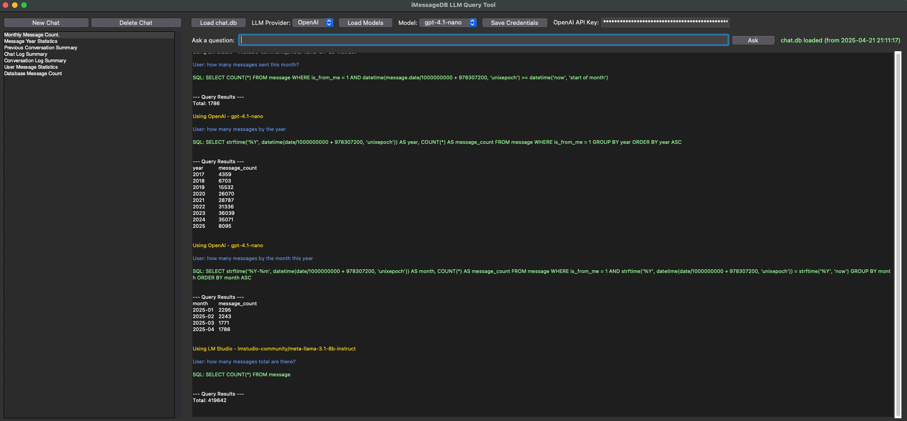

# 🤖 CW AI App Library

A collection of powerful AI-powered applications for enhanced productivity and communication.

## 🚀 Quick Links

- [AI Prompt Desktop](#ai-prompt-desktop) - Cross-platform desktop app for AI interactions ([Repository](https://github.com/CWade3051/AIPrompt))
- [Prompt Library Mobile](#prompt-library-mobile) - Mobile app for managing AI prompts ([Repository](https://github.com/walmart-acquisition-tech/cw-prompt-library-mobile))
- [Prompt Library](#prompt-library) - Web-based prompt management system ([Repository](https://github.com/walmart-acquisition-tech/cw-prompt-library))
- [iMessage DB](#imessage-db) - AI-powered iMessage analysis tool ([Repository](https://github.com/CW-Computing/cw-iMessageDB))

## 📱 Applications Overview

### AI Prompt Desktop

A powerful cross-platform desktop application that provides an intuitive interface for interacting with AI language models through both OpenAI's API and LM Studio's local server.

**Key Features:**
- 🔄 Support for both OpenAI API and LM Studio local models
- 💻 Cross-platform compatibility (Windows and macOS)
- 🗂️ Chat history management with persistent storage
- 🛠️ System command generation and execution
- 📝 Real-time command output display

[Learn more about AI Prompt Desktop](https://github.com/CWade3051/AIPrompt)

### Prompt Library Mobile

A mobile application designed for managing and organizing AI prompts on the go. Perfect for professionals who need quick access to their prompt library from their mobile devices.

**Key Features:**
- 📱 Native mobile experience
- 🔄 Sync with Prompt Library web platform
- 📂 Offline prompt access
- 🏷️ Tag-based organization
- 🔍 Advanced search capabilities

[Learn more about Prompt Library Mobile](https://github.com/walmart-acquisition-tech/cw-prompt-library-mobile)

### Prompt Library

A comprehensive web-based platform for managing, organizing, and sharing AI prompts across teams and organizations.

**Key Features:**
- 🌐 Web-based interface
- 👥 Team collaboration tools
- 📊 Usage analytics
- 🔒 Access control
- 🔄 Version control for prompts

[Learn more about Prompt Library](https://github.com/walmart-acquisition-tech/cw-prompt-library)

### iMessage DB

An innovative tool that leverages AI to analyze and extract insights from your iMessage conversations on macOS.

**Key Features:**
- 📊 Conversation analytics
- 🔍 Advanced search capabilities
- 📈 Trend analysis
- 🤖 AI-powered summarization
- 🔒 Privacy-focused design

[Learn more about iMessage DB](https://github.com/CW-Computing/cw-iMessageDB)

## 🛠️ Technology Stack

- **Frontend**: React Native, React, Electron
- **Backend**: Python, Node.js
- **AI Integration**: OpenAI API, LM Studio
- **Database**: SQLite, PostgreSQL
- **Cloud**: AWS, Azure

## 🔒 Privacy & Security

All applications in the library are designed with privacy and security in mind:
- End-to-end encryption where applicable
- Local data processing options
- Secure API key management
- Compliance with data protection regulations

## 📝 License

Each application is licensed under its respective terms. Please refer to individual repositories for specific licensing information.

## 🤝 Contributing

Contributions are welcome! Please check each repository's contributing guidelines for more information.

---

Made with ❤️ by Charles Wade
